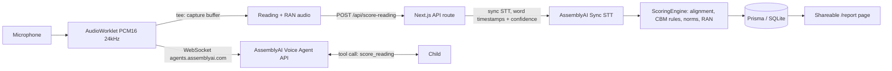

# ReadPulse

A virtual reading specialist: a conversational voice agent that listens to a
child read aloud for one minute, scores it by the book (Curriculum-Based
Measurement), benchmarks against US national norms, and drills the exact
words the child missed — in one 5-minute session.

## The 60-second story

Oral reading fluency (ORF), measured as words correct per minute (WCPM), is
the standard Tier-1 reading screener in US schools — but manual screening
needs a trained examiner, one-on-one time, and stopwatch-and-paper scoring.
Schools screen 2-3 times per year; children at risk are often noticed late.

ReadPulse is a voice agent that administers and scores the probe itself:
AssemblyAI's Voice Agent API handles the conversation with the child, then
the same audio is re-scored offline with batch speech-to-text (word
timestamps + confidence) feeding a transparent, fully unit-tested CBM
scoring engine. Every rule, threshold, and citation is public in
[METHODOLOGY.md](METHODOLOGY.md).

## How it works

1. The agent greets the child and collects first name, grade (1-6), and
   season (fall/winter/spring).
2. The child reads a leveled passage aloud; the agent stays silent while the
   client captures the audio.
3. After 60 seconds of reading (or when the child finishes), the agent gives
   a stop cue; the audio is sent to the server for batch STT and scoring.
4. The agent speaks the result naturally and runs a 30-second rapid naming
   (RAN) task, then drills each missed word (model -> echo) and re-reads
   error sentences.
5. A shareable report page shows WCPM vs national percentile bands,
   accuracy, error taxonomy, missed-word drill list, and RAN naming speed.

## Architecture



Two AssemblyAI products in one pipeline, each where it is strongest: the
Voice Agent API runs the real-time conversation (turn-taking, VAD, TTS,
tool calling); sync STT provides word-level timestamps and confidence that
precise scoring requires. The scoring engine (`src/lib/scoring/`) is pure
TypeScript with zero I/O — every CBM rule is a unit test.

## The science

- WCPM scoring implements published CBM/DIBELS 8 rules: 60-second window,
  self-correction within 3 seconds, hesitation > 3 seconds, Levenshtein
  word alignment, accuracy formula with the 95% instructional-level flag.
- Benchmarking interpolates against Hasbrouck & Tindal (2017) national
  norms, with tests locking every transcribed table cell.
- Known ASR limitations (auto-correction of misread words) are disclosed and
  mitigated via confidence flagging and a validation study.
- Full details: [METHODOLOGY.md](METHODOLOGY.md). Validation status:
  [VALIDATION.md](VALIDATION.md).

## Quickstart

Requirements: Node 20+, pnpm, an AssemblyAI API key.

```bash
pnpm install

# .env.local
# AAI_API_KEY=your-assemblyai-api-key
# DATABASE_URL="file:./dev.db"

pnpm exec prisma db push
pnpm dev
```

Open:

| URL | Purpose |
|---|---|
| `/` | Landing page |
| `/session` | Full guided voice session (child flow) |
| `/demo` | Audio-file demo (score a WAV/MP3 without a microphone) |
| `/report/readpulse-seed` | Example report (run `pnpm seed` first) |

## Testing

```bash
pnpm test    # 59 unit tests, including locked norms cells and every CBM rule
pnpm e2e     # Playwright end-to-end smoke
```

## Validation

The system-vs-human agreement study replicates published ASR-ORF validation
methodology. Collect recordings per `scripts/validation/PROTOCOL.md`, then:

```bash
pnpm validation:run       # transcribe + system-score every labeled recording
pnpm validation:analyze   # compute r, MAE, error comparison -> VALIDATION.md
```

## Deploy

Next.js is auto-detected by Vercel; no extra config is needed.

```bash
pnpm add -g vercel
vercel
```

Then set `AAI_API_KEY` and `DATABASE_URL` in the Vercel dashboard (Project
Settings > Environment Variables). Note: the default SQLite database is
best-effort on serverless (ephemeral filesystem, data resets between
deployments/instances); a production deployment should point `DATABASE_URL`
at Postgres.

## License and credits

Original work by the ReadPulse team, MIT licensed — see [LICENSE](LICENSE).
Built for the AssemblyAI Voice Agent Hackathon 2026 (lablab.ai).
