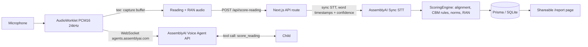

# 🎙️ ReadPulse

<div align="center">
  
  
  
</div>

<br />

> **A virtual reading specialist built for the AssemblyAI Voice Agent Hackathon 2026.**
> 
> ReadPulse is a conversational voice agent that listens to a child read aloud for one minute, scores it by the book (Curriculum-Based Measurement), benchmarks against US national norms, and drills the exact words the child missed — all in a single 5-minute session.

**[🎥 Watch the Demo Video Here] (Link to YouTube/Loom)** | **[✨ Try it live] (Link to deployed app)**

---

## 🎯 The Problem

Oral reading fluency (ORF), measured as words correct per minute (WCPM), is the standard Tier-1 reading screener in US schools. However, manual screening requires a trained examiner, one-on-one time, and stopwatch-and-paper scoring. Because it is so labor-intensive, schools typically only screen 2-3 times per year, meaning children at risk are often noticed too late.

## 💡 The Solution

**ReadPulse** automates the entire screening and intervention process using AssemblyAI. The voice agent administers and scores the probe itself:
- **AssemblyAI's Voice Agent API** handles the warm, natural conversation with the child.
- **AssemblyAI Sync STT** processes the audio offline with batch speech-to-text (providing word timestamps + confidence) to feed a transparent, fully unit-tested CBM scoring engine.

Every rule, threshold, and citation is completely transparent. See [METHODOLOGY.md](METHODOLOGY.md) for the science behind our scoring.

---

## 🚀 How It Works

1. **Setup:** A teacher or parent fills out a quick web form with the child's name, grade (1-6), and season. 
2. **Conversation:** The agent greets the child by name and gently guides them to start the session.
3. **Assessment:** The child reads a leveled passage aloud. The agent stays completely silent while the client captures the audio.
4. **Scoring:** After 60 seconds, the agent gives a stop cue. The audio is sent to the server for precision batch STT and CBM scoring.
5. **Intervention (Drill):** The agent speaks the result naturally, runs a 30-second rapid naming (RAN) task, and then engages in an echo-drill practice for each missed word.
6. **Reporting:** A shareable report page provides WCPM vs. national percentile bands, accuracy, an error taxonomy, and a missed-word drill list.

*(Insert UI Screenshot Here)*

---

## 🏗️ Architecture



**Two AssemblyAI products in one pipeline, each where it is strongest:** 
The Voice Agent API runs the real-time conversation (turn-taking, VAD, TTS, tool calling); Sync STT provides word-level timestamps and confidence that precise scoring requires. 

---

## 🔬 The Science & Validation

- WCPM scoring implements published CBM/DIBELS 8 rules: 60-second window, self-correction within 3 seconds, hesitation > 3 seconds, Levenshtein word alignment.
- Benchmarking interpolates against Hasbrouck & Tindal (2017) national norms.
- **Validation Study:** We conducted a system-vs-human agreement study replicating published ASR-ORF validation methodology. See [VALIDATION.md](VALIDATION.md).

---

## 💻 Quickstart

Requirements: Node 20+, `pnpm`, and an AssemblyAI API key.

```bash
pnpm install

# Create a .env.local file
# AAI_API_KEY=your-assemblyai-api-key
# DATABASE_URL="file:./dev.db"

pnpm exec prisma db push
pnpm dev
```

### Available Routes

| URL | Purpose |
|---|---|
| `/` | Landing page |
| `/session` | Full guided voice session (child flow) |
| `/demo` | Audio-file demo (score a WAV/MP3 without a microphone) |
| `/report/readpulse-seed` | Example report (run `pnpm seed` first) |

---

## 🧪 Testing

```bash
pnpm test    # 59 unit tests, including locked norms cells and every CBM rule
pnpm e2e     # Playwright end-to-end smoke
```

---

## ☁️ Deploy

Next.js is auto-detected by Vercel; no extra config is needed.

```bash
pnpm add -g vercel
vercel
```
*Set `AAI_API_KEY` and `DATABASE_URL` in the Vercel dashboard. Note: the default SQLite database is ephemeral on serverless; a production deployment should point `DATABASE_URL` to a Postgres instance.*

---

## 📜 License and Credits

Original work by the ReadPulse team, MIT licensed — see [LICENSE](LICENSE).
Built for the **AssemblyAI Voice Agent Hackathon 2026 (lablab.ai)**.
